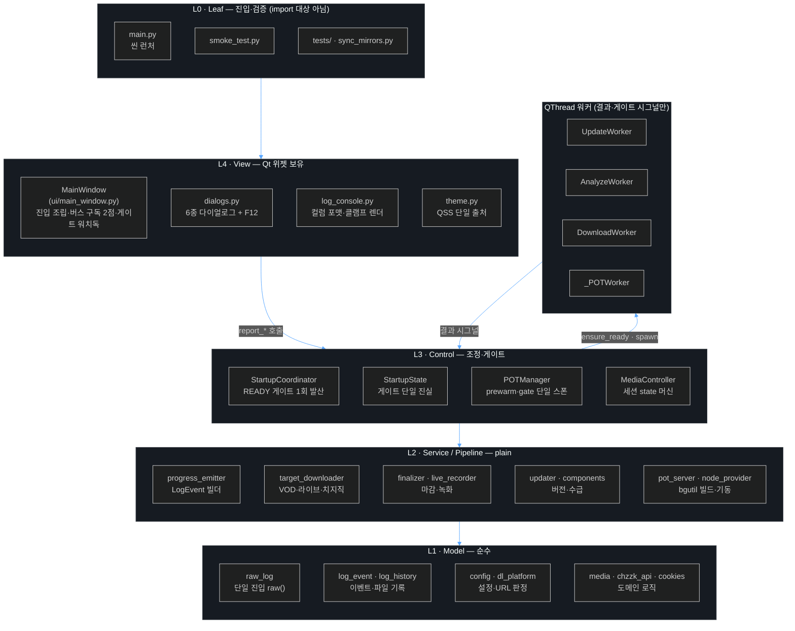
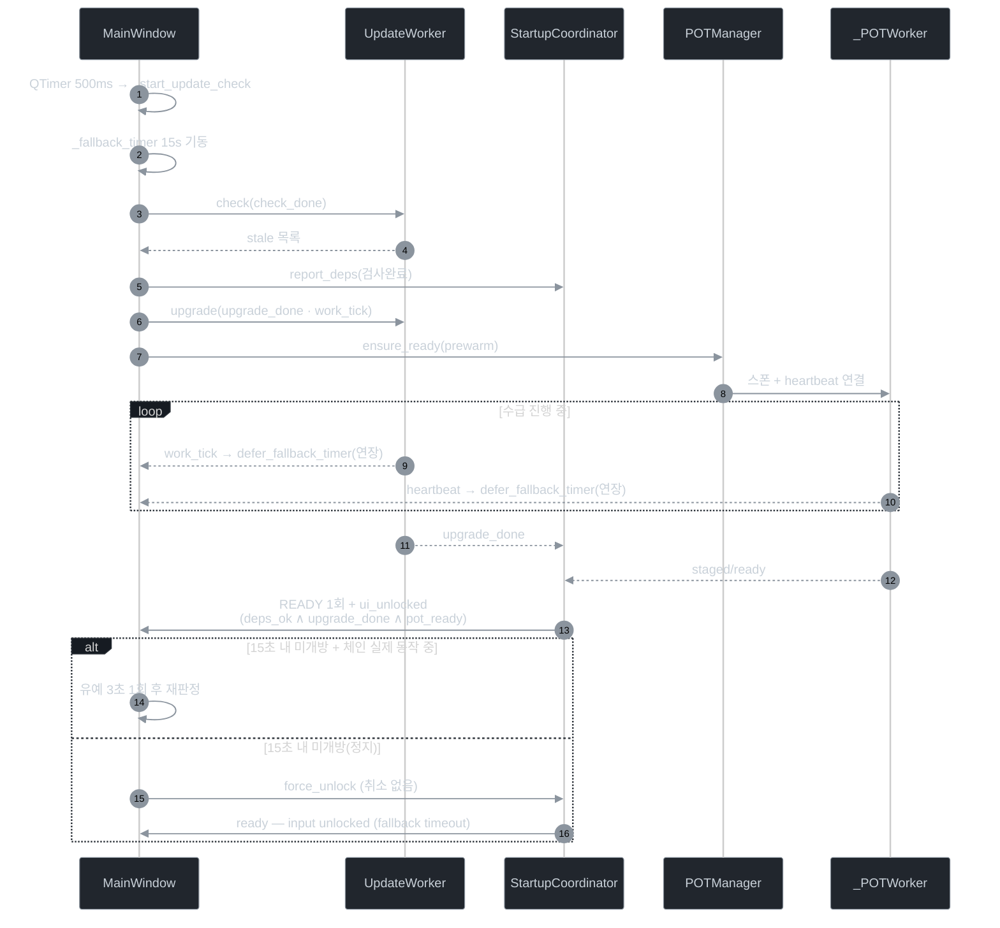
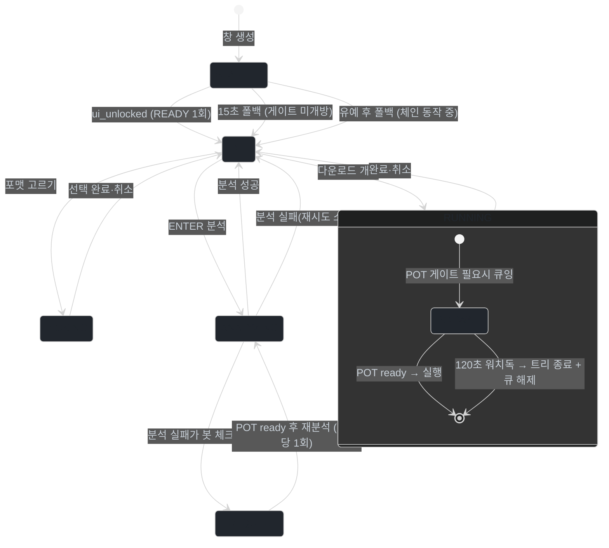

## ChzzkTube

Hyper-Minimalist Modern TUI 미디어 추출기 — YouTube / 치지직(Chzzk) 영상·라이브 다운로드를 위한 개인용·비상업적 듀얼유즈 도구.

"fzf · lazygit" 감성의 모노스페이스 Flat TUI로, OS 순정 GUI 위젯 없이 콘솔만으로 모든 작업을 처리한다.

### 스택

- Python 3.12.14 (pyenv / `.python-version` 고정) + PySide6
- yt-dlp + streamlink + FFmpeg(리먹싱)
- Node.js 22+ (PO Token 서버 — 백그라운드 감시, 필요 시에만 기동)

### 실행

```bash
# 가상환경 권장 (예: .venv)
python main.py            # 루트 씬 런처 → chzzktube.ui.main_window.main()
```

- `F12`: 전체 상세 로그(F12 창) 열기
- `ESC / Enter`: URL 입력창 초기화 / 분석·다운로드 시작
- 설정: `dl_config.json`(CONFIG_DIR) — 저장 경로·포맷·쿠키·업데이트 채널 등 23개 기본 키

### 소스 구조 (레이어 패키지)

```
main.py                      # 씬 런처 (python main.py / PyInstaller 진입점)
chzzktube/
  ui/                        # L3 View (Qt 위젯) — main_window·dialogs·theme·log_console
  control/                   # L2 오케스트레이터 — controller·startup_coordinator·pot_manager
  workers/                   # L1 QThread — downloader·analyze_worker·update_worker
  pipeline/                  # L0.5 파이프라인 함수 — target_downloader·finalizer·live_recorder
  core/                      # L0 도메인/순수 — config·log_emitter(Qt-free)·media·utils 등
  infra/                     # L0 인프라 — po_client·node_provider·pot_server·updater
assets/                      # icon.ico · CascadiaMono 폰트 (spec datas 1:1)
docs/                        # HANDOVER · CHANGELOG · 아키텍처 등
mirrors/                     # sync_mirrors.py 생성 산출물 (.py → .md)
```

### 빌드

- PyInstaller `ChzzkTube.spec` 기반 onedir/onefile 빌드가 구성되어 있다.
- 환경은 `.python-version` 및 프로젝트 의존 패키지를 기준으로 맞춘다.

### PO Token 서버 (PO 우회)

- 앱은 백그라운드에서 PO Token 서버를 준비하되, 일반 공개 영상은 PO 없이도 진행된다.
- 기동 직후 prewarm으로 **디스크 스테이징만** 수행(RAM 0MB·포트 미점유), 연령 제한·멤버십·게이트 영상에서 필요한 시점에만 gate로 서버를 기동한다(lazy-on-demand).
- READY 게이트는 DEPS + 업데이트 + POT 사전 스테이징이 모두 완료된 실완료 토큰(`staged`/`ready`)으로만 개방되며, 기존 서버가 이미 응답 중이면 스폰 없이 즉시 재사용한다.
- 서버 프로토콜/빌드는 bgutil 계열 서버 소스를 사용하며, 로컬 포트(127.0.0.1)만 사용한다.
- `po_client`는 표준 라이브러리만 쓰는 L0 리프 — 서버 생존은 순수 HTTP /ping만으로 판정하고 상위 계층의 내부(락 파일 등)를 참조하지 않는다.

### 주의사항

- 네트워크 접근이 본질인 도구다(yt-dlp 스트리밍, PO 서버 빌드·갱신 등).
- 로그 설계: 모든 동작 로그는 `raw_log.raw()` 단일 버스 진입 — history·F12는 전량 수신, 메인 TUI는 발행자의 `to_tui` 선택으로 팬아웃한다.
- 스레드 설계: `raw_log`는 표준 라이브러리만 쓰는 순수 dispatcher(bounded queue)이며, GUI 갱신은 `main._GuiLogBridge`의 Qt Signal(QueuedConnection)을 통해 메인 스레드에서만 실행된다 — 워커 스레드의 위젯 직접 접근은 구조적으로 차단된다.
- 로그 규격(v3.4.0): 메인 TUI는 `[HH:MM:SS] STAGE │ STATUS │ SCOPE │ MSG`의 4컬럼 고정 폭을 사용한다. `PLATFORM`·`SPEC`은 별도 컬럼으로 출력하지 않으며, 미디어/버전 정보는 MSG 앞 태그로 보존한다.
- 설정 기본값: `download_path`, `container`, `embed_subtitles`, `audio_only`, `fast_download`, `remove_duplicates`, `auto_open_folder`, `completion_action`, `play_sound`, `max_video_res`, `pick_format`, `filename_prefix`, `filename_suffix`, `browser_cookie`, `cookie_file_path`, `yt_player_client`, `update_channel`, `auto_update_check`, `streamlink_quality`, `embed_thumbnail`, `embed_chapters`, `subtitle_langs`, `concurrent_fragments`
- CI: push/PR 시 GitHub Actions가 `QT_QPA_PLATFORM=offscreen` 환경에서 전체 pytest를 실행한다. 저장소에는 커밋 전 훅(pre-commit) 설정이 없다 — 검증은 CI와 `pytest tests/` 수동 실행으로 수행한다.

### 전체 계층도 (L4 View → L0 Leaf, 단방향)



### 기동 시퀀스 (READY 게이트 · 15초 폴백 · 동적 워치독)



### 상태·워치독 관계 (게이트 · 큐 · 재시도)


