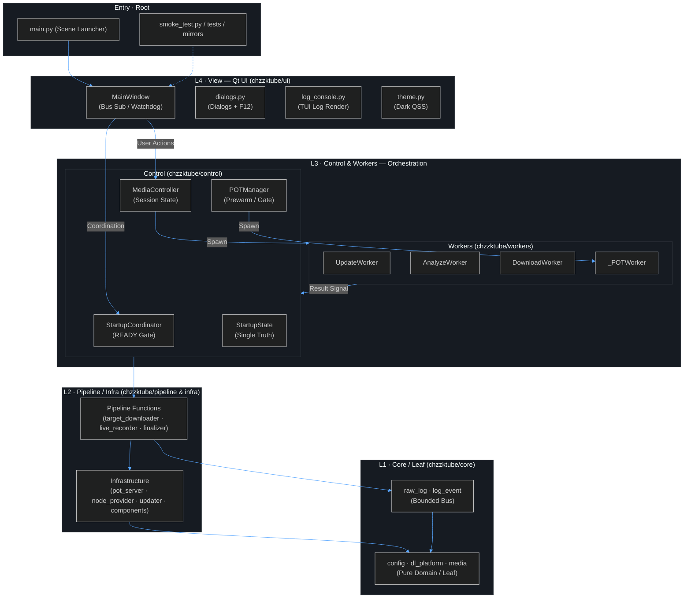
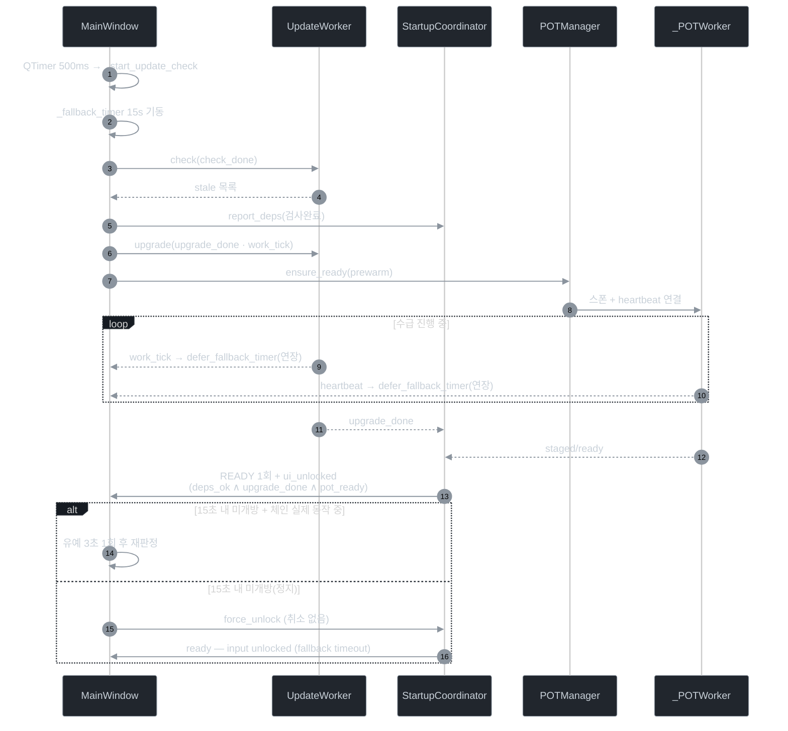
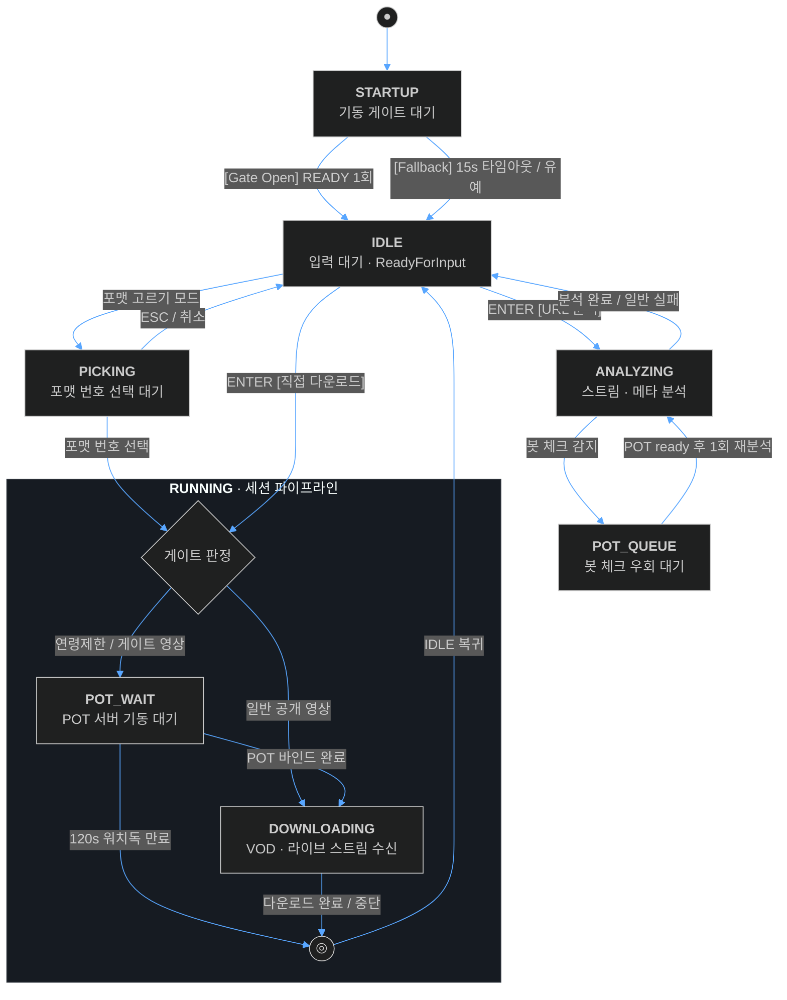

## 🗺️ Mermaid 아키텍처 다이어그램 (2026-09-16 실측 — v3.6.0)

> GitHub / VS Code / Mermaid Live Editor에서 직접 렌더된다. 노드 텍스트의 특수문자는
> 코드 실물과 대조해 갱신할 것(아스키 화살표·박스도는 렌더러가 처리한다).

### 1) 전체 계층도 (L0 Launcher → L4 View → L1 Model)

### 2) 기동 시퀀스 (READY 게이트 · 15초 폴백 · 동적 워치독)

### 3) 상태·워치독 관계 (게이트 · 큐 · 재시도)

