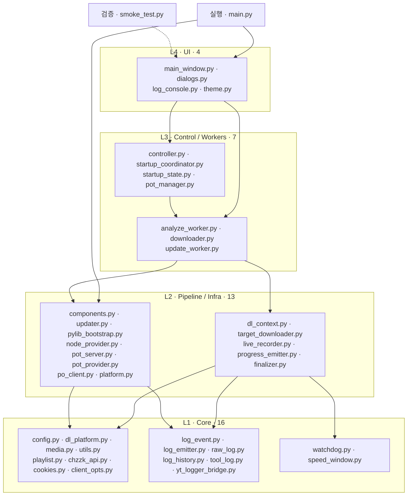
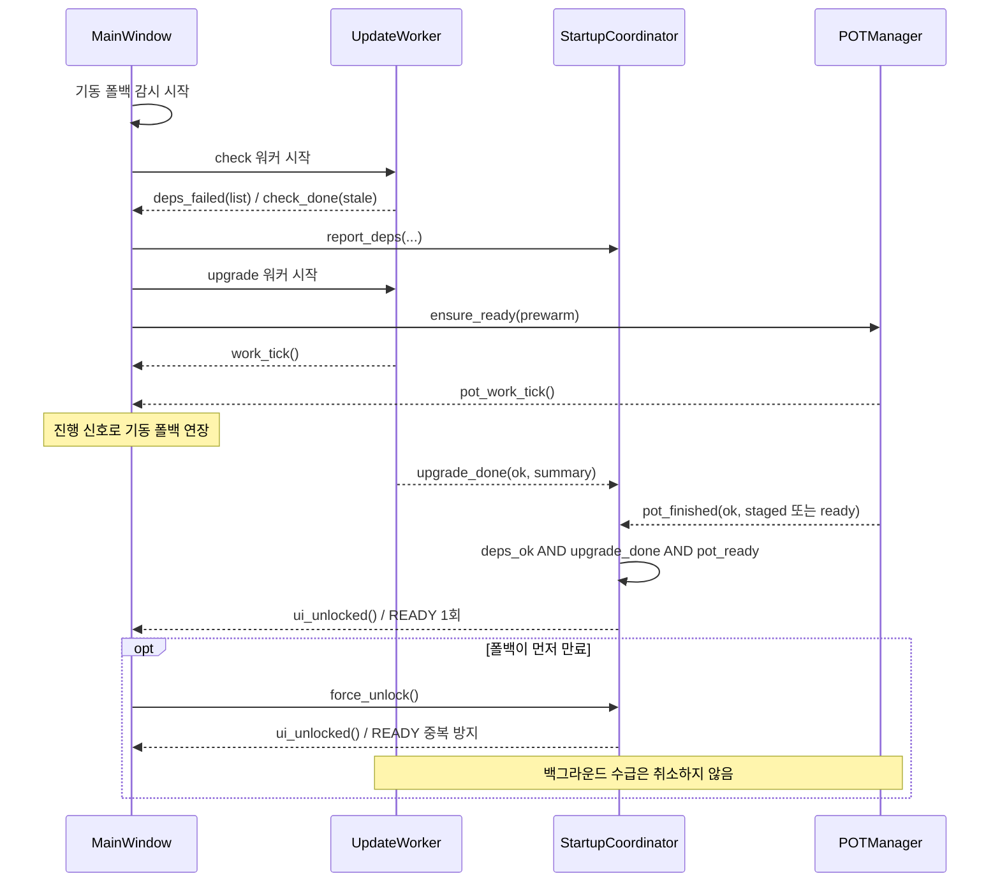
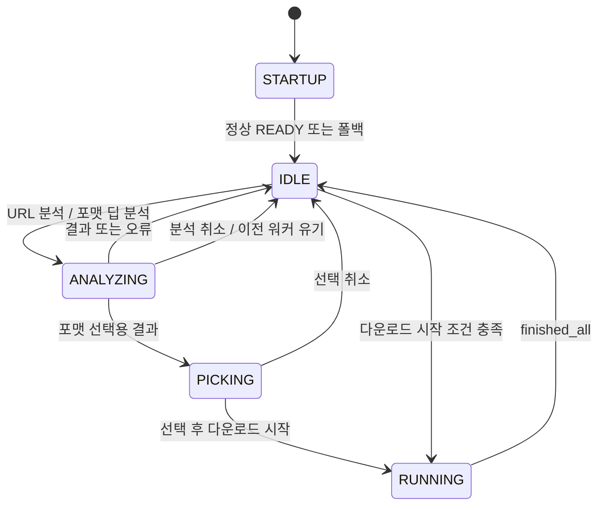
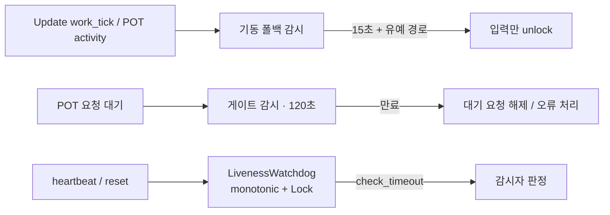
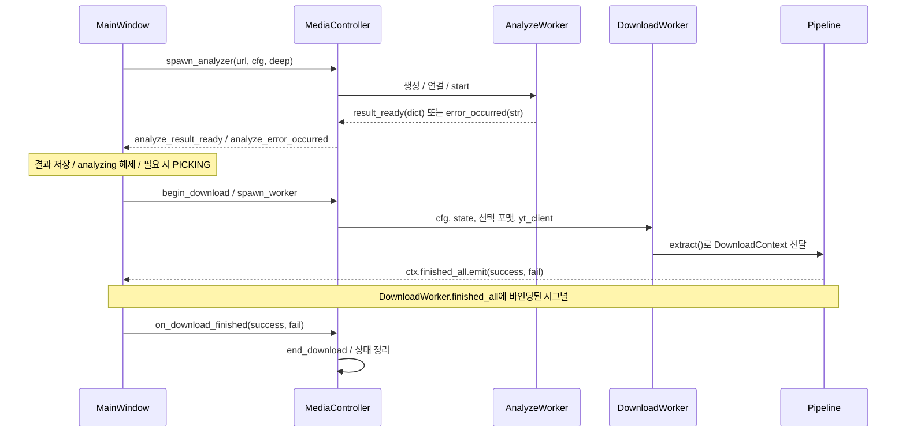
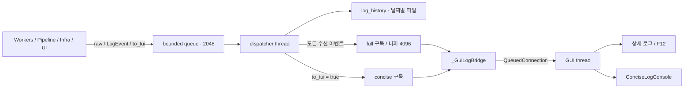
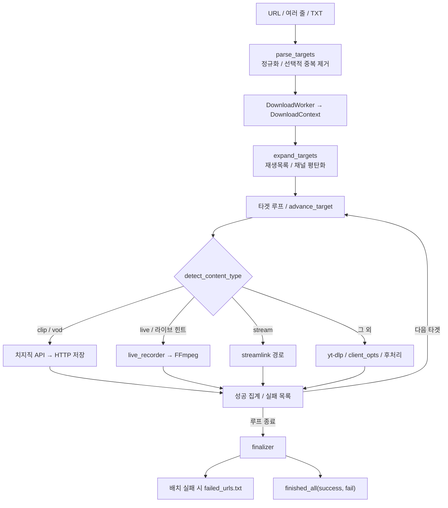
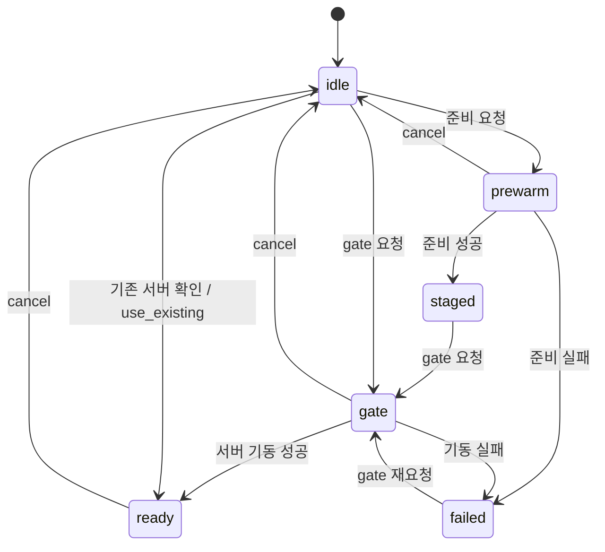
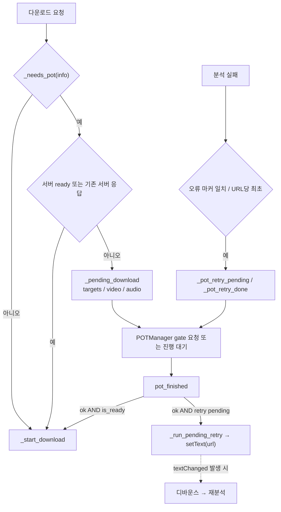
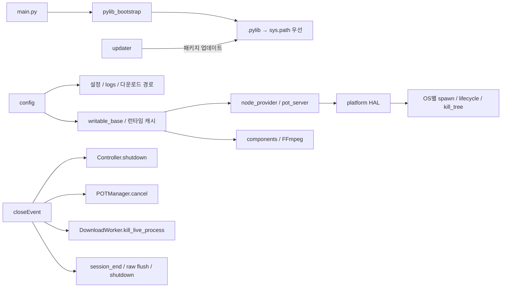

# ChzzkTube 아키텍처

> 2026-09-18 · v3.8.0 소스 대조. 문서의 계층은 **책임 구분**이며 엄격한 import DAG를 뜻하지 않는다.
> 기준 루트: `/Users/jskim/Documents/ChzzkTube`. 아래 모듈명은 각 그룹의 절대 경로에 속한다.
> **집계:** 패키지 기능 모듈 40개 + 루트 실행·검증 진입점 2개 = 도식 내 Python 파일 42개.
> 빈 `__init__.py` 7개, 테스트·미러·빌드/유지보수 스크립트는 기능 모듈 집계에서 제외한다.

## 1) 전체 계층도 — 40개 기능 모듈 + 진입점 2개

모듈을 책임별 상자에 모으고 대표 호출만 연결한다. 모든 import를 선으로 그리지 않는다.
`_POTWorker`는 별도 모듈이 아니라 `pot_manager.py` 내부 클래스다.

| 그룹 | 절대 경로 | 파일 수 |
|---|---|---:|
| 실행·검증 | `/Users/jskim/Documents/ChzzkTube/main.py`, `/Users/jskim/Documents/ChzzkTube/smoke_test.py` | 2 |
| UI | `/Users/jskim/Documents/ChzzkTube/chzzktube/ui` | 4 |
| Control | `/Users/jskim/Documents/ChzzkTube/chzzktube/control` | 4 |
| Workers | `/Users/jskim/Documents/ChzzkTube/chzzktube/workers` | 3 |
| Pipeline | `/Users/jskim/Documents/ChzzkTube/chzzktube/pipeline` | 5 |
| Infra | `/Users/jskim/Documents/ChzzkTube/chzzktube/infra` | 8 |
| Core | `/Users/jskim/Documents/ChzzkTube/chzzktube/core` | 16 |

**계층 해석:** Core 전체가 순수 함수는 아니다. `media.py`는 FFmpeg/파일 I/O,
`chzzk_api.py`는 HTTP, `cookies.py`는 DB 접근을 수행한다. `client_opts.py`는 Infra의
`po_client.py`를 사용한다. `node_provider.py`에는 UI 로그 모듈 import도 남아 있어
“역참조 0”으로 표기하지 않는다. HAL `platform.py`와 HTTP 클라이언트 `po_client.py`는
Infra 안에 있지만 표준 라이브러리만 사용하는 말단 모듈이다.

## 2) 기동 시퀀스 — 입력 준비와 서버 가동은 별개

- `check_done(list)`는 Coordinator에 직접 연결하지 않는다. MainWindow가 보고 형식을 변환한다.
- `report_upgrade()`의 완료 플래그는 **성공 여부가 아니라 작업 종료**를 뜻한다.
- `report_pot()`는 성공 토큰 `staged` / `ready`를 인정하며 `standby`는 호환 입력이다.
  사람이 읽는 임의 성공 문구는 게이트를 열지 않는다.
- **staged = 준비물 확보**, **ready = 서버 가동 상태**. 입력 READY와 다운로드용 POT ready를 혼동하지 않는다.

## 3) UI 상태·대기열·워치독

`get_current_app_state()`가 반환하는 상태는 위 **5개**뿐이다. `POT_QUEUE`, `POT_WAIT`,
`DOWNLOADING`은 별도 enum 상태가 아니다. 대기는 `_pot_retry_pending`,
`_pending_download`와 POTManager 상태로 표현한다. 표시 우선순위는
`STARTUP > RUNNING > ANALYZING > PICKING > IDLE`이다.

상수의 단일 출처는 `/Users/jskim/Documents/ChzzkTube/chzzktube/core/watchdog.py`:
기동 15초, 유예 3초, 게이트 120초, 분석 45초. `heartbeat()`는 유예 사용 여부도 초기화한다.
**현재 구현 주의:** MainWindow에는 기존 single-shot QTimer와 1초 워치독 폴링이 공존한다.
분석·다운로드 워커의 워치독은 View의 인스턴스와 별개다. 따라서 “구독형 완전 전환” 또는
“다운로드 진행이 모든 워치독을 자동 연장한다”는 보장은 이 문서에서 하지 않는다.

## 4) 결과 시그널과 데이터 계약

| 발행자 | 계약 | 수신자 / 의미 |
|---|---|---|
| AnalyzeWorker | `result_ready(dict)` | Controller → View, `info`, `v_list`, `a_list` 등 결과 |
| AnalyzeWorker | `error_occurred(str)` | Controller → View, 실패 및 재시도 판정 |
| DownloadWorker | `finished_all(int, int)` | View, 성공·실패 집계 — 로그가 아닌 세션 종료 통보 |
| UpdateWorker | `check_done(list)`, `deps_failed(list)` | View, 업데이트 대상과 실제 구성요소 실패를 분리 |
| UpdateWorker | `upgrade_done(bool, str)` | Coordinator의 `report_upgrade`에 직접 연결 |
| POTManager | `pot_finished(bool, str)` | Coordinator + View, 토큰은 `staged` / `ready` / `failed` |
| Coordinator | `ui_unlocked()` | View의 기동 완료 플래그 설정 |
| Coordinator | `ready_emitted(str, bool, str)` | READY 통지용 공개 신호, 입력 해제 연결은 `ui_unlocked` |
| 작업 워커 | `work_tick()` / `heartbeat()` | 무페이로드 진행 통보, 로그 채널로 사용하지 않음 |

- `cfg`와 `state`는 복사하지 않고 공유한다. Pipeline은 QThread 대신 `DownloadContext`를 받는다.
- 분석 결과의 `yt_client`를 다운로드에 전달한다. 경량 분석과 실제 다운로드의 옵션은 별도로 구성한다.
- 취소 요청은 UI가 `state['canceled']`에 기록한다. `skip`도 요청 플래그지만 현재 다운로드 루프가 소비 후 `False`로 되돌리므로 **완전한 UI 단독 쓰기**로 설명하면 부정확하다.
- 이전 분석 워커는 결과 연결을 끊고 Controller의 `_zombie_workers`에 보관한다. `finished` 후 회수하여 오래된 결과가 UI에 섞이지 않도록 한다.

## 5) 로그 버스 — 스레드 경계와 채널 포함관계

- 워커 로그용 `log_full` / `log_concise` Signal을 다시 만들지 않는다. Qt 시그널은 결과·제어와 GUI 브리지에 사용한다.
- 로그의 라벨과 TUI 노출 여부는 **발행자**가 결정한다. View에서 문자열을 재해석해 채널을 선택하지 않는다.
- `is_status=True`는 진행 행 갱신, `rendered=True`는 완성된 문자열의 재포맷 방지를 뜻한다.
- 정상 수신 기준으로 **history / full ⊇ TUI**다. 큐가 가득 차면 해당 이벤트 자체가 버려지고 overflow 경고를 남기므로 “어떤 부하에서도 전량 보존”은 아니다. F12 메모리 버퍼도 유한하다.
- dispatcher에서 위젯을 직접 조작하지 않는다. 파일 기록은 dispatcher, UI 렌더링은 GUI 스레드 책임이다.

## 6) 다운로드 파이프라인 — 대상 확장·분기·마감

진행률은 `progress_emitter`와 `SpeedWindow`로 로그 버스에 전달한다.
`finalizer`는 실패 목록·배치 결론·완료 시그널을 담당하며, 폴더 열기 등 UI 후속 동작은 View에 남는다.

**분기 주의:** 현재 `live` 타입에는 치지직 라이브도 들어가지만 `download_target()`은 이를
`_download_youtube_live()`로 보낸다. 위 그림은 현행 함수 분기이며 플랫폼별 정상 녹화를 검증했다는 뜻이 아니다.
또한 `expand_targets()`는 워커 최상위 `try` 밖(루프 진입 직후)에서 호출되며, `finally` → `_fin.finalize()` → `finished_all.emit`이 정확히 한 번만 발행되도록 구조화됐다(v3.8.0).

## 7) POT 수명주기 — 준비와 가동을 분리

- 상태명은 POTManager의 `_mode` 기준이다. gate 워커 실행 중 내부 모드는 `gate`, 외부 상태 신호는 `starting`이다.
- prewarm 도중 gate 요청은 `_pending_gate`로 보관한다. 준비 성공 후 `QTimer.singleShot(0, ...)`으로 gate 워커를 이어서 시작한다.
- `_POTWorker.finished_signal(bool, str)`의 상세 결과를 Manager가 상태 토큰으로 변환한다. `_POTWorker.heartbeat()`는 `pot_work_tick()`으로 전달한다.
- `use_existing()`은 `/ping` 확인 뒤 즉시 ready로 표시하며 `pot_finished`를 별도로 발행하지 않는다.
- 서버 빌드/기동은 `pot_server`, Node 런타임 수급은 `node_provider`, HTTP 확인은 `po_client`, 호환 재수출은 `pot_provider` 책임이다.

## 8) POT 대기 다운로드와 분석 재시도

- 분석 재시도 처리가 대기 다운로드 회수보다 먼저다. 오류 문자열 전부가 아니라 `_needs_pot_retry()`의 지정 마커만 대상이다.
- `_pot_retry_done`은 URL당 반복 시도를 차단한다. v3.8.0부터 재시도는 `url_input.setText(url)`(textChanged 비파리)에서 `Controller.spawn_analyzer(url)` 명시 호출로 전환 — 문자열 동등성에 관계없이 분석이 재시작된다.
- gate timeout은 Manager가 busy일 때 취소하고 `_pending_download`를 해제한다. 분석 재시도 플래그까지 모두 청소하는 계약은 현재 코드에 없다.
- 일반 공개 영상은 POT 백그라운드 작업만을 이유로 입력을 잠그지 않는다. 입력 READY는 서버 준비 보증이 아니다.

## 9) 런타임 배치와 프로세스 소유권

개발 venv는 uv 소유이며 인앱 업데이트는 `.pylib` 오버레이를 사용한다. 이미 import한 모듈이
파일 교체만으로 자동 재로드된다고 가정하지 않는다. HAL 도입과 별개로 OS 분기가 남은 호출부가 있으므로
“모든 OS 처리가 완전히 격리됐다”는 표현도 피한다. 종료는 제한 시간 wait와 프로세스 정리를 시도하며,
모든 QThread의 자연 종료를 보장한다고 단정하지 않는다.

## 현재 문서와 구현을 읽을 때의 주의점

> `docs/HANDOVER.md`의 정책과 이력은 참고하되, 현재 구조와 신호 연결은 소스와 대조해야 한다. 아래는 v3.8.0 기준 수리 완료와 남은 항목을 구분한 것이다.

> `docs/HANDOVER.md`의 정책과 이력은 참고하되, 현재 구조와 신호 연결은 소스와 대조해야 한다. 아래는 v3.8.0 기준 수리 완료와 남은 항목을 구분한 것이다.

### 수리 완료 (v3.8.0)

- **워치독 단일 진실**: 폴링 내 UI 재초기화 제거(초기화는 생성자 1회, 링 타이머는 초기화 완료 후 시작) · 게이트 QTimer 폐지(`_gate_watchdog_active` 플래그) · fallback `_fallback_timer` 단일 판정(`_fallback_watchdog` 삭제) · 분석 워커는 3 spawn-site에서 arm/disarm. (참고: `DownloadWorker`는 다운로드 중 파일/스트림 liveness만 판별하는 자체 watchdog을 유지 — 게이트/폴백 워치독과는 별개.)
- **분석 타임아웃 뷰 소유**: 워커는 무페이로드 `activity`만 발행하고, 만료 시 `_on_analysis_timeout()`이 워커를 유기하고 FAIL로 마감. 강제 terminate와 죽은 타이머 참조는 제거.
- `DownloadContext` — `_last_tick_t/_live_proc/_meta_logged` 속성 선언 충족.
- `live_recorder` — stdout-relay 단일 소유권: FFmpeg `pipe:1` → Python이 TS 기록(replace-on-success / 실패·취소 시 TS 유지 / empty→False).
- POT 재시도 — `Controller.spawn_analyzer()` 명시 재시도(`url_input.setText` 비파리 의존 제거).
- `expand_targets()`를 워커 최상위 try 밖에서 호출해 `finally` → `_fin.finalize()` → `finished_all.emit` 정확히 한 번 보장.
- Infra→UI 역참조 제거(`node_provider`) + 테스트 세션 QApplication 단일화(`tests/conftest.py`).
- Chzzk live v2 API(`_analyze_chzzk_live_v2`) + `playlist` 채널 탭 정규화.

### 수리 완료 (v3.8.0)

- **근원 원인**: 앱이 포터블 Node.js(`~/.chzzktube/node`)를 수급했으나 yt-dlp가 PATH의 `deno`만 탐색 → n-challenge(EJS) 해결이 불가 → `No video formats found` 회전 실패.
- `client_opts._apply_ejs_opts` — `node_provider.node_exe()` 탐색 node를 `js_runtimes={'node':{'path':...}}`로 명시 주입(분석/라이브/다운로드 4 경로). node 없으면 기본(deno) 유지.
- `analyze_worker` — 회전 후보 `ios`(쿠키 미지원) → `tv`/`web_safari`(쿠키 호환); bot-block 판정에 no-video-formats/requested-format 포함.
- `analyze_worker` — analysis error를 60자로 절약(TUI MSG 컬럼), `[youtube] <id>:` 접두와 보고서 꼬리 절삭.
- `target_downloader` — "Requested format is not available" 분류 `is` 누락 교정 + no-video-formats → `format missing`.
- `ui/dialogs.py` — `TuiNoticeDialog`(280×125·칠흑·중앙정렬·OK/View) 신설; `show_info_message` 위임 + 쿠키 흐름 영어 사용자 문자열.

### 남은 항목 (미수리 — §2 도식은 계약이며 검증 보장이 아니다)

- `client_opts.py`(Core)가 `infra.po_client`를 사용한다. 폴더 기준 L1→L2 방향이므로 말단 HTTP 클라이언트로 볼지 계층 정책 결정이 필요하다.
