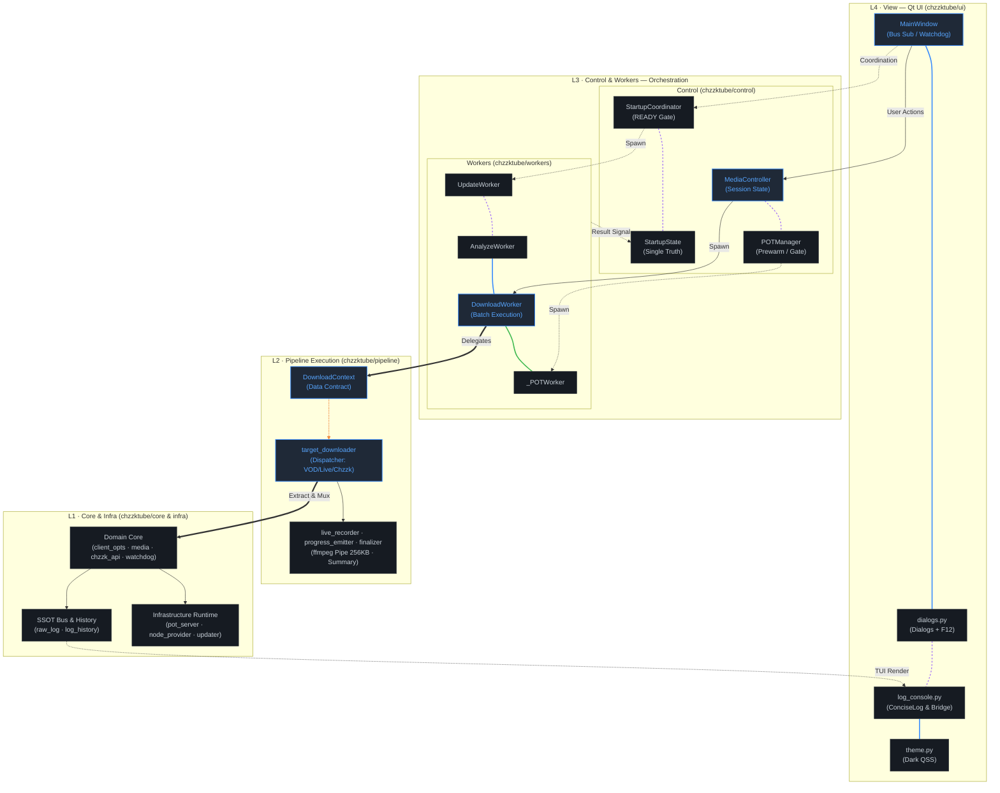

```mermaid
flowchart TB
%% ══════════════════════════════════════════════════════════════════
%% ChzzkTube Architecture: High-Readability GitHub Dark Edition
%% ══════════════════════════════════════════════════════════════════

    %% [Tier 1: View Layer]
    subgraph L4 ["L4 · View — Qt UI (chzzktube/ui)"]
        direction LR
        MW["MainWindow<br/>(Bus Sub / Watchdog)"]
        DLG["dialogs.py<br/>(Dialogs + F12)"]
        LOG["log_console.py<br/>(ConciseLog & Bridge)"]
        THEME["theme.py<br/>(Dark QSS)"]

        MW ~~~ DLG ~~~ LOG ~~~ THEME
    end

    %% [Tier 2: Control & Workers Orchestration]
    subgraph L3 ["L3 · Control & Workers — Orchestration"]
        subgraph CTRL_GRP ["Control (chzzktube/control)"]
            CTRL["MediaController<br/>(Session State)"]
            POTM["POTManager<br/>(Prewarm / Gate)"]
            COORD["StartupCoordinator<br/>(READY Gate)"]
            STATE["StartupState<br/>(Single Truth)"]

            CTRL --- POTM
            COORD --- STATE
        end

        subgraph WORK_GRP ["Workers (chzzktube/workers)"]
            W_UPD["UpdateWorker"]
            W_ANA["AnalyzeWorker"]
            W_DL["DownloadWorker<br/>(Batch Execution)"]
            W_POT["_POTWorker"]

            W_UPD ~~~ W_ANA ~~~ W_DL ~~~ W_POT
        end
    end

    %% [Tier 3 Left: Pipeline Execution]
    subgraph L2 ["L2 · Pipeline Execution (chzzktube/pipeline)"]
        CTX["DownloadContext<br/>(Data Contract)"]
        TDL["target_downloader<br/>(Dispatcher: VOD/Live/Chzzk)"]
        PIPE_MODS["live_recorder · progress_emitter · finalizer<br/>(ffmpeg Pipe 256KB · Summary)"]

        CTX --> TDL --> PIPE_MODS
    end

    %% [Tier 3 Right: Core Domain & Infra]
    subgraph L1 ["L1 · Core & Infra (chzzktube/core & infra)"]
        CORE_MODS["Domain Core<br/>(client_opts · media · chzzk_api · watchdog)"]
        INFRA_MODS["Infrastructure Runtime<br/>(pot_server · node_provider · updater)"]
        LOG_BUS["SSOT Bus & History<br/>(raw_log · log_history)"]

        CORE_MODS --> INFRA_MODS
        CORE_MODS --> LOG_BUS
    end

%% ══════════════════════════════════════════════════════════════════
%% Inter-Layer Flow (의미별 연결 관계)
%% ══════════════════════════════════════════════════════════════════
    %% 0: Main User Action
    MW --> |"User Actions"| CTRL
    %% 1: Startup Sync
    MW -.-> |"Coordination"| COORD
    %% 2: Download Spawn
    CTRL --> |"Spawn"| W_DL
    %% 3: Update Spawn
    COORD -.-> |"Spawn"| W_UPD
    %% 4: POT Spawn
    POTM -.-> |"Spawn"| W_POT
    %% 5: Worker State Feedback
    WORK_GRP -.-> |"Result Signal"| STATE
    %% 6: Execution Delegation
    W_DL ==> |"Delegates"| CTX
    %% 7: Core Extraction
    TDL ==> |"Extract & Mux"| CORE_MODS
    %% 8: Log Feedback to Console
    LOG_BUS -.-> |"TUI Render"| LOG

%% ══════════════════════════════════════════════════════════════════
%% GitHub Dark Color Styling (연결선 종류별 디자인 차별화)
%% ══════════════════════════════════════════════════════════════════
    %% 1. 메인 실행 흐름 (GitHub Blue 실선 / 굵은 선)
    linkStyle 0,2,6 stroke:#388bfd,stroke-width:2.5px;

    %% 2. 수명주기 / 스폰 / 제어 신호 (Purple 점선)
    linkStyle 1,3,4,5 stroke:#a371f7,stroke-width:2px,stroke-dasharray:4 4;

    %% 3. 데이터 및 파이프라인 추출 (Emerald Green 실선)
    linkStyle 7 stroke:#3fb950,stroke-width:2.5px;

    %% 4. 로깅 / 관측성 피드백 (Amber Dotted 점선)
    linkStyle 8 stroke:#f0883e,stroke-width:2px,stroke-dasharray:2 2;

    %% 클래스 정의 (다크 모드 카드 룩앤필)
    classDef default fill:#161b22,stroke:#30363d,stroke-width:1px,color:#c9d1d9;
    classDef primaryNode fill:#1f2937,stroke:#388bfd,stroke-width:1.5px,color:#58a6ff;
    class MW,CTRL,W_DL,TDL,CTX primaryNode;
```