```mermaid
flowchart TB
%% ══════════════════════════════════════════════════════════════════
%% ChzzkTube Architecture: GitHub Optimized Vertical Stack
%% ══════════════════════════════════════════════════════════════════

    %% [Layer 3: UI View]
    subgraph L3 ["Layer 3: View (chzzktube/ui/)"]
        direction TB
        subgraph L3_CORE ["Presentation Core"]
            MW["MainWindow<br/>(Event Loop & State Sync)"]
            LC["ConciseLogConsole<br/>(In-place status & Pixel Clamp)"]
            DLG["Dialogs (Settings / F12 Verbose)"]
            MW --> LC
            MW --> DLG
        end
        BRIDGE["_GuiLogBridge<br/>(QObject QueuedConnection Boundary)"]
        BRIDGE -. "tui_signal / full_signal" .-> MW
    end

    %% [Layer 2: Control & Orchestration]
    subgraph L2 ["Layer 2: Control & Orchestration (chzzktube/control/)"]
        direction TB
        subgraph L2_ORCH ["State Machines & Lifecycle"]
            direction LR
            CTRL["MediaController<br/>(Session State)"]
            COORD["StartupCoordinator<br/>(Sequence Gates)"]
            STATE["StartupState<br/>(RLock Protected)"]
            POTM["POTManager<br/>(Single Spawn Guard)"]
        end
        COORD <--> STATE
        COORD <--> POTM
    end

    %% [Layer 1: Workers]
    subgraph L1 ["Layer 1: Workers (chzzktube/workers/)"]
        direction LR
        W_UPD["UpdateWorker<br/>(DEPS / Upgrade)"]
        W_ANA["AnalyzeWorker<br/>(Light Extraction)"]
        W_DL["DownloadWorker<br/>(Batch Execution)"]
        W_POT["_POTWorker<br/>(Staging / Build)"]
    end

    %% [Layer 0.5: Pipeline]
    subgraph L05 ["Layer 0.5: Pipeline Execution (chzzktube/pipeline/)"]
        direction TB
        CTX["DownloadContext (Pipeline Data Contract)"]
        subgraph L05_PIPE ["Execution Modules"]
            direction LR
            TDL["target_downloader<br/>(Target Dispatcher)"]
            LREC["live_recorder<br/>(Relay Pipe 256KB)"]
            PEMIT["progress_emitter<br/>(0.5s Throttle Tick)"]
            FIN["finalizer<br/>(Summary & txt)"]
        end
        CTX --> TDL
        TDL --> LREC
        TDL --> PEMIT
        CTX --> FIN
    end

    %% [Layer 0: Core Domain & Log SSOT]
    subgraph L0_CORE ["Layer 0: Core Domain & Log SSOT (chzzktube/core/)"]
        direction TB
        subgraph L0_LOG ["Unified Log Bus"]
            RLOG["raw_log.raw()<br/>(SSOT Dispatcher & Bounded Queue)"]
            HIST["log_history.py<br/>(Daily File Append)"]
            RLOG --> HIST
        end
        subgraph L0_MEDIA ["Domain & Utility Models"]
            direction LR
            MEDIA["media.py<br/>(Codec Rank)"]
            CHZZK["chzzk_api.py<br/>(Clip/VOD/LIVE)"]
            OPTS["client_opts.py<br/>(Option Builder)"]
            DLP["dl_platform.py<br/>(URL Routing)"]
            WDOG["watchdog.py<br/>(LivenessWatchdog)"]
        end
    end

    %% [Layer 0: Infra & External Runtime]
    subgraph L0_INFRA ["Layer 0: Infra & Runtime Provisioning (chzzktube/infra/)"]
        direction TB
        FACADE["pot_provider.py (Re-export Facade)"]
        subgraph L0_INFRA_LEAF ["Runtime Leaf Implementations"]
            direction LR
            POC["po_client.py<br/>(Pure HTTP /ping)"]
            POTS["pot_server.py<br/>(Lifecycle & Lock)"]
            NODE["node_provider.py<br/>(Node 22+ Runtime)"]
            COMP["components.py<br/>(FFmpeg Auto)"]
            UPDR["updater.py<br/>(PyPI / Wheel)"]
        end
        FACADE -.-> POC
        FACADE -.-> POTS
        FACADE -.-> NODE
    end
```

```mermaid
%% ══════════════════════════════════════════════════════════════════
%% Inter-Layer Structural Flow (Vertical Backbone)
%% ══════════════════════════════════════════════════════════════════

    %% L3 <-> L2 Control Link
    MW <== "User Interaction / Status Sync" ==> CTRL
    MW <== "ready_emitted / ui_unlocked" ==> COORD

    %% L2 -> L1 Lifecycle Spawning
    CTRL --> W_DL
    CTRL --> W_ANA
    COORD -. "Check Trigger" .-> W_UPD
    POTM --> W_POT

    %% L1 -> L2 Signals
    W_UPD -- "upgrade_done(ok)" --> COORD
    W_ANA -- "result_ready(dict)" --> CTRL
    W_DL -- "finished_all(int, int)" --> MW
    W_POT -- "finished_signal(token)" --> POTM

    %% L1 -> L0.5 Delegation
    W_DL ==> "Delegates with Context" ==> CTX

    %% L0.5 -> L0 Core Integration
    TDL -.-> OPTS
    TDL -.-> MEDIA
    TDL -.-> CHZZK

    %% L1 -> L0 Infra Provisioning
    W_UPD -.-> UPDR
    W_UPD -.-> COMP
    W_POT -.-> POTS

    %% Event Boundary back to View (Log Loop)
    RLOG -- "Worker Thread to GUI Loop" --> BRIDGE
```