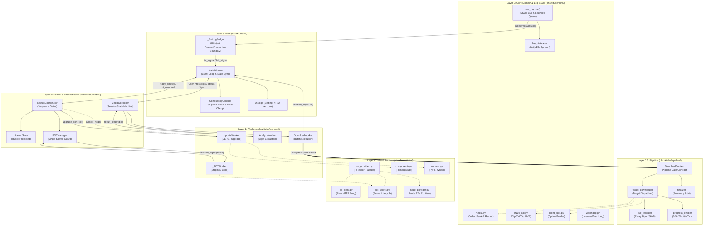

```mermaid
flowchart TB
%% ══════════════════════════════════════════════════════════════════
%% ChzzkTube Architecture: GitHub Markdown Validated Vertical Stack
%% ══════════════════════════════════════════════════════════════════

    subgraph L3 ["Layer 3: View (chzzktube/ui/)"]
        direction TB
        MW["MainWindow<br/>(Event Loop & State Sync)"]
        LC["ConciseLogConsole<br/>(In-place status & Pixel Clamp)"]
        DLG["Dialogs (Settings / F12 Verbose)"]
        BRIDGE["_GuiLogBridge<br/>(QObject QueuedConnection Boundary)"]
        
        MW --> LC
        MW --> DLG
        BRIDGE -. "tui_signal / full_signal" .-> MW
    end

    subgraph L2 ["Layer 2: Control & Orchestration (chzzktube/control/)"]
        direction TB
        CTRL["MediaController<br/>(Session State Machine)"]
        COORD["StartupCoordinator<br/>(Sequence Gates)"]
        STATE["StartupState<br/>(RLock Protected)"]
        POTM["POTManager<br/>(Single Spawn Guard)"]

        COORD <--> STATE
        COORD <--> POTM
    end

    subgraph L1 ["Layer 1: Workers (chzzktube/workers/)"]
        direction TB
        W_UPD["UpdateWorker<br/>(DEPS / Upgrade)"]
        W_ANA["AnalyzeWorker<br/>(Light Extraction)"]
        W_DL["DownloadWorker<br/>(Batch Execution)"]
        W_POT["_POTWorker<br/>(Staging / Build)"]
    end

    subgraph L05 ["Layer 0.5: Pipeline (chzzktube/pipeline/)"]
        direction TB
        CTX["DownloadContext<br/>(Pipeline Data Contract)"]
        TDL["target_downloader<br/>(Target Dispatcher)"]
        LREC["live_recorder<br/>(Relay Pipe 256KB)"]
        PEMIT["progress_emitter<br/>(0.5s Throttle Tick)"]
        FIN["finalizer<br/>(Summary & txt)"]

        CTX --> TDL
        TDL --> LREC
        TDL --> PEMIT
        CTX --> FIN
    end

    subgraph L0_CORE ["Layer 0: Core Domain & Log SSOT (chzzktube/core/)"]
        direction TB
        RLOG["raw_log.raw()<br/>(SSOT Bus & Bounded Queue)"]
        HIST["log_history.py<br/>(Daily File Append)"]
        MEDIA["media.py<br/>(Codec Rank & Remux)"]
        CHZZK["chzzk_api.py<br/>(Clip / VOD / LIVE)"]
        OPTS["client_opts.py<br/>(Option Builder)"]
        WDOG["watchdog.py<br/>(LivenessWatchdog)"]

        RLOG --> HIST
    end

    subgraph L0_INFRA ["Layer 0: Infra & Runtime (chzzktube/infra/)"]
        direction TB
        FACADE["pot_provider.py<br/>(Re-export Facade)"]
        POC["po_client.py<br/>(Pure HTTP /ping)"]
        POTS["pot_server.py<br/>(Server Lifecycle)"]
        NODE["node_provider.py<br/>(Node 22+ Runtime)"]
        COMP["components.py<br/>(FFmpeg Auto)"]
        UPDR["updater.py<br/>(PyPI / Wheel)"]

        FACADE -.-> POC
        FACADE -.-> POTS
        FACADE -.-> NODE
    end

%% ══════════════════════════════════════════════════════════════════
%% Inter-Layer Structural Flow (Vertical Backbone)
%% ══════════════════════════════════════════════════════════════════

    %% L3 <-> L2 Control Link (교정: 파이프 라벨 구문 적용)
    MW <--> |"User Interaction / Status Sync"| CTRL
    MW <--> |"ready_emitted / ui_unlocked"| COORD

    %% L2 -> L1 Lifecycle Spawning
    CTRL --> W_DL
    CTRL --> W_ANA
    COORD -. "Check Trigger" .-> W_UPD
    POTM --> W_POT

    %% L1 -> L2 Signals
    W_UPD -- "upgrade_done(ok)" --> COORD
    W_ANA -- "result_ready(dict)" --> CTRL
    W_DL -- "finished_all(int, int)" --> MW
    W_POT -- "finished_signal(token)" --> POTM

    %% L1 -> L0.5 Delegation (교정: 표준 두꺼운 링크 텍스트 구문)
    W_DL == "Delegates with Context" ==> CTX

    %% L0.5 -> L0 Core Integration
    TDL -.-> OPTS
    TDL -.-> MEDIA
    TDL -.-> CHZZK

    %% L1 -> L0 Infra Provisioning
    W_UPD -.-> UPDR
    W_UPD -.-> COMP
    W_POT -.-> POTS

    %% Event Boundary back to View (Log Loop)
    RLOG -- "Worker to GUI Loop" --> BRIDGE
```